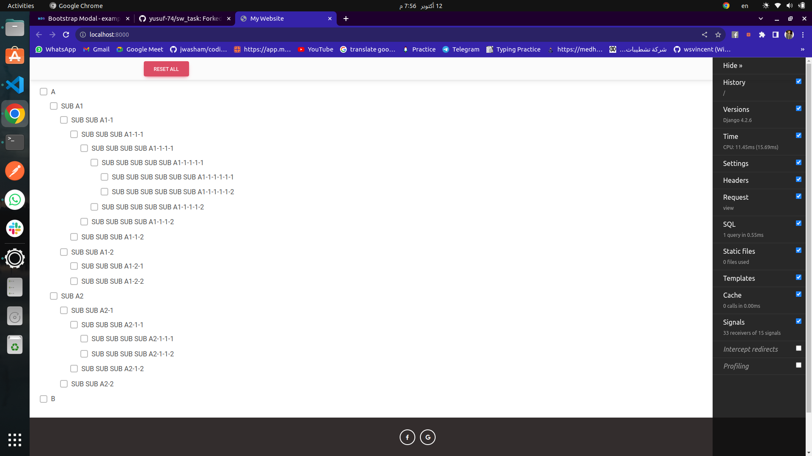
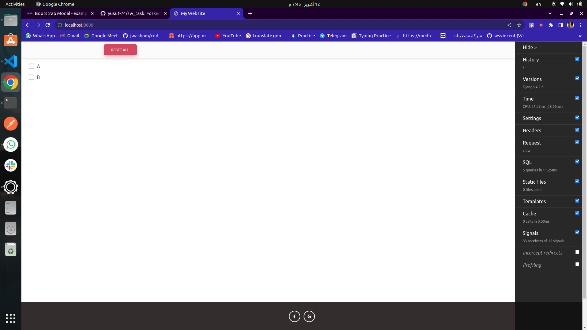

# Rightshero Software Engineer Task Assessment

## Overview

I have successfully completed the software engineer task assessment at Rightshero. As a potential candidate to join your software development team, I was tasked with creating a web application that allows users to manage categories and subcategories dynamically. I am pleased to report that I have fulfilled all the requirements efficiently.

## Task Description

The task involved creating a web application with the following key features:

1. A single web page with two categories: Category A and Category B.
2. The ability to have unlimited subcategories under Category B, with dynamic rendering using AJAX.

Here's a snapshot of the user interface I implemented:

- [ ] Category A
- [x] Category B
  - [x] Sub Category B1
    - [x] Sub Sub Category B1-1
      - [ ] Sub Sub Category B1-1-1
      - [ ] Sub Sub Category B1-1-2
    - [ ] Sub Sub Category B1-2
  - [ ] Sub Category B2

    - ...

## Project Setup

```bash
git clone https://github.com/yusuf-74/sw_task.git
cd sw_task
```

To run the project, you will need to have Docker and Docker Compose installed on your machine. Once you have installed the required dependencies, you can run the following command to start the web service and the database:

```bash
docker-compose up --build
```
you can access the web app at [Task](http://localhost:8000)

## Screenshots

### Home Page
</img>

### after adding subcategories

</img>

### after deleting subcategories

</img>


## Achievements

In completing this task, I have successfully incorporated the following features and best practices:

### Dynamic Categories

I implemented a dynamic category system that allows users to add unlimited subcategories under Category A or B. The use of AJAX ensures a seamless and user-friendly experience.

### Technology Stack

I selected the Django framework and used a PostgreSQL database to build the project, meeting the specified requirements.

### Database Design

I designed a single, efficient database table to manage all categories and subcategories, optimizing data storage and retrieval.

### Code Structure

I followed the MVC (Model-View-Controller) pattern to maintain a clean and organized codebase. Additionally, I added comments throughout the code to provide valuable insights for future developers.

### Dockerization

The project is fully dockerized with a Docker Compose configuration for both the web service and the database, simplifying deployment in various environments.

### Security

I ensured the security of the application by implementing best practices in web development, including hiding sensitive information in environment variables and using Django's built-in security features.

### Version Control

Throughout the project, I diligently used Git to maintain a version control system, allowing for effective tracking of changes and facilitating collaboration.

## Deliverables

My submission includes the following deliverables:

- A fully functional web application with the capability of unlimited category nesting.
- A well-structured database schema for managing categories and subcategories.
- A codebase with comprehensive comments and adherence to the MVC pattern.
- Docker Compose setup for straightforward deployment.
- A Pull Request (PR) submitted to the Rightshero repository, with my email address matching the one provided in my CV/Resume.

## Conclusion

I have successfully completed the Rightshero Software Engineer Task Assessment. My solution meets all (at least what i've understanded;)) the specified requirements and reflects my dedication to delivering high-quality software. The project is ready for review and integration into the Rightshero project.

If you have any questions or need further information, please do not hesitate to reach out. I appreciate the opportunity to work on this task and look forward to your feedback. Thank you for your consideration.