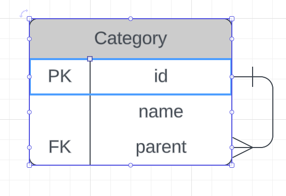
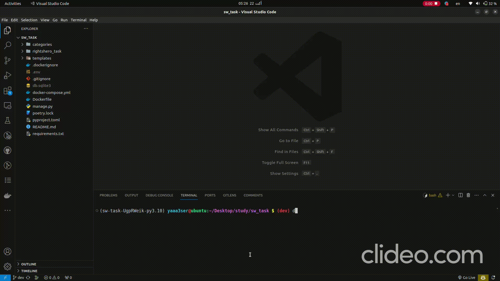

# Rightshero Software Engineer Task Assessment
This is a task for creating unlimited sub categories checkboxes from 2 basic categories checkboxes.

## Table of Contents
- [Task description](#task-description)
- [Technologies](#technologies)
- [Setup](#setup)
- [Features](#features)
- [DB design](#db-design)
- [Demo](#demo)

## Task description

The task will be a project contains one page having 2 checkboxes:
- [ ] Category A
- [ ] Category B

and if you check one of them, the page will show you another 2 checkboxes related to the category you checked:

as example if you checked Category B, the page will show you:

- [ ] SUB Category B1
- [ ] SUB Category B2

and selecting the second sub category as example will create another 2 checkboxes under it:

- [ ] SUB SUB Category B2-1
- [ ] SUB SUB Category B2-2

and so on.

**Also you can delete all categories and sub categories and start again.**

## Technologies

- **Django**: Django is a high-level Python Web framework that encourages rapid development and clean, pragmatic design.
- **PostgreSQL**: PostgreSQL is a powerful, open source object-relational database system.
- **Docker**: Docker is a set of platform as a service products that use OS-level virtualization to deliver software in packages called containers.
- **Docker Compose**: Compose is a tool for defining and running multi-container Docker applications.


## Setup

```bash
# Clone the repo
git clone https://github.com/yaaa3ser/sw_task.git
cd sw_task
```

To run the project, you will need to have Docker and Docker Compose installed on your machine. Once you have installed the required dependencies, you can run the following command to start the web service and the database:

```bash
docker-compose up --build
```
you can access the web app at 'http://localhost:8000'


## Features

- [x] Create 2 categories checkboxes (Category A, Category B)
- [x] Selecting one of them will show you another 2 checkboxes related to the category you checked and so on.
- [x] Using postman to delete all categories and sub categories with the url 'http://localhost:8000/' and method 'DELETE'


## DB design


- **Category** table has 3 columns:
    - **id**: primary key
    - **name**: category name
    - **parent**: foreign key to the same table to make the relation between categories and sub categories


## Demo

